# Practica Seguridad Lógica

## Actividad 1 - Búsqueda de información

### Rainbowcrack

Rainbowcrack es un programa que genera rainbow tables para usarlas en el crackeo de contraseñas. Se difiere de otros programas de crackeo por fuerza bruta porque usa grandes tablas de desencriptación que reducen el tiempo necesario para crackear una contraseña de forma drástica 

Enlace descarga: http://project-rainbowcrack.com/

Manual de uso: https://www.youtube.com/watch?v=PmFcd--6_Dw

### Grub

GNU GRUB es un gestor de arranque, creado en 1995, capaz de arrancar diferentes tipos de sistemas operativos libres, así como sistemas operativos privativos, a través del arranque en cadena que luego se explica.

Enlace descarga: https://ftp.gnu.org/gnu/grub/

Manual de uso: https://www.gnu.org/software/grub/grub-documentation.html

### Libpam-cracklib

Libpam-cracklib es un módulo de configuración de políticas de contraseña que aumenta la seguridad frente a ataques de crackeo por fuerza bruta 	

Enlace descarga: apt-get install libpam-cracklib

Manual de uso: https://man7.org/linux/man-pages/man8/pam_cracklib.8.html

### Ultimate Boot CD

Ultimate Boot CD es un conjunto de herramientas para realizar pruebas y diagnósticos que se pueden grabar en un Live CD. Este disco se usa, sobre todo, para poder ejecutar pruebas en un ordenador cuyo sistema operativo estuviese dañado y no arrancase bien.

Enlace descarga: https://www.ultimatebootcd.com/download.html

Manual de uso: https://studylib.es/doc/710551/tutorial-de-uso--ultimate-boot-cd

### Ophcrack

Ophcrack es una herramienta para crackear las contraseñas de Windows basada en las tablas Rainbow. ​ Es una implementación muy eficiente de las tablas Rainbow hecha por los inventores de este método.

Enlace descarga: https://ophcrack.sourceforge.io/download.php

Manual de uso: https://joseconejos.wordpress.com/2018/06/10/como-recuperar-o-hackear-una-contrasena-con-ophcrack/

### Slax

Slax es una minidistribución y Live CD del sistema operativo GNU/Linux basado en la distribución Slackware y Debian. No necesita ser instalado, es capaz de arrancar y funcionar desde una unidad de CD, siendo innecesario el uso de un disco duro.

Enlace descarga: https://www.slax.org/?lang=es///en/download.php

Manual de uso: https://tecnopedia.net/linux/instalar-slax-linux-en-tu-pendrive/

### Wifiway - Wifislax

Wifislax es una distribución GNU/Linux en formato *. iso basada en Slackware con funcionalidades de LiveCD y LiveUSB pensada y diseñada para la auditoría de seguridad y relacionada con la seguridad informática en general.

Enlace descarga: https://www.wifislax.com/category/download/versiones-anteriores/

Manual de uso: https://www.wifislax.com/wp-content/uploads/2013/08/MANUAL-BASICO-WIFISLAX3.pdf

### Pwdump

Pwdump es el nombre de varios programas de windows que permiten extraer los hashes LM y NTLM de cuentas de usuario locales desde el fichero SAM. Debe ser ejecutado con permisos de administrador 

Enlace descarga: http://foofus.net/goons/fizzgig/pwdump/downloads.htm

Manual de uso: https://docs.bmc.com/docs/TSInfrastructure11304/pw-dump-937360450.html

### Cain & Abel

Cain & Abel (frecuentemente abreviado a Cain) es una herramienta de recuperación de contraseñas para Microsoft Windows. Puede recuperar muchos tipos de contraseñas utilizando métodos como el sniffing de paquetes de red, también puede crackear varios hashes de contraseñas utilizando métodos maliciosos como ataques de diccionario, de fuerza bruta y ataques basados en "criptoanálisis"

Enlace descarga: https://www.malavida.com/es/soft/cain-and-abel/

Manual de uso: https://dis.um.es/~lopezquesada/documentos/IES_1314/SAD/curso/UT4/ActividadesAlumnos/grupo2/documentos/Tutorial_Cain.pdf

### L0pht Crack

L0phtCrack es una herramienta de auditoría y recuperación de contraseñas (ahora llamada LC5), originalmente producida por Mudge de L0pht Heavy Industries. Es usada para verificar la debilidad de las contraseñas y algunas veces para recuperar las que se han olvidado o perdido en sistemas Microsoft Windows.

Enlace descarga: https://l0phtcrack.gitlab.io/

Manual de uso: https://www.youtube.com/watch?v=CzRqN8IQ-i0

### John the Ripper

John the Ripper es una herramienta para recuperación de contraseñas. Originalmente desarrollado para el sistema operativo Unix, puede funcionar en quince plataformas diferentes

Comando descarga: sudo apt-get install john

Manual de uso: https://www.fpgenred.es/Seguridad-Informatica-I/ms_sobre_john_the_ripper.html

### Windows Steady State

Windows SteadyState permite establecer Protección de disco de Windows para eliminar todos los cambios al reiniciar, para eliminar todos los cambios en una fecha y hora concretas, o para no eliminar los cambios.

Enlace descarga: https://www.microsoft.com/es-es/download/details.aspx?id=6692

Manual de uso: https://www.microsoft.com/es-es/download/details.aspx?id=22218

### Keepass Password Safe

KeePass es una herramienta que te ayuda a tener todas tus contraseñas seguras almacenadas en un mismo lugar sin necesidad de tener que memorizarlas todas. 

Enlace descarga: https://keepass.info/download.html

Manual de uso: https://www.youtube.com/watch?v=qpNlX2BcSh0

### DeepFreeze

Deep Freeze es un controlador del núcleo que protege la integridad del disco duro redirigiendo la información que se va a escribir en el disco duro o partición protegida, dejando la información original intacta. Las escrituras redirigidas desaparecen cuando el sistema es reiniciado, restaurando el equipo a su estado original.

Enlace descarga: https://www.faronics.com/es/downloads_es

Manual de uso: https://www.faronics.com/assets/DFS_Manual_S.pdf

## Actividad 2 - Configuración de Contraseñas Seguras en Windows y Linux

Realiza en Windows Server y el Ubuntu Server la configuración básica para el establecimiento de las directivas de complejidad de las contraseñas que se van a utilizar.

Para establecer las directivas de complejidad de contraseñas en Windows Server se hace en las directivas de contraseña que está en “Administrador del servidor -> Herramientas -> Directiva de seguridad local -> Configuración de cuenta -> Directivas de cuenta -> Directivas de contraseñas”. 

Aquí seleccionamos dos Propiedades: 
* La contraseña ha de cumplir los requisitos de complejidad, es decir contener minúsculas, mayúsculas, números, etc.
* Longitud mínima de la contraseña que la estableces a los carácteres que quieras

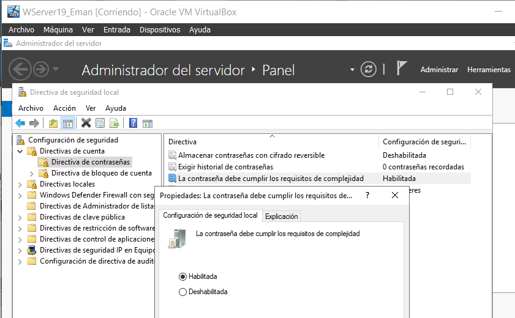
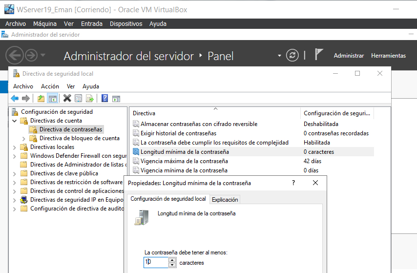

Para establecer la complejidad de contraseñas en Linux se debe instalar un paquete llamado “libpam-cracklib”

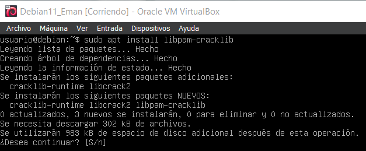

Ahora si vemos el fichero “/etc/pam.d/common-password” podemos ver abajo los requisitos de contraseña por defecto y que podemos modificar con los siguientes parametros

* retry: número de intentos antes de que el sistema devuelva un error en la autenticación y nos expulse.
* minlen: es la longitud mínima de la contraseña, por defecto está en 8 caracteres.
* difok: número de caracteres diferentes que debe tener la nueva clave en comparación con la antigua.
* ucredit: caracteres en mayúscula que debe tener como mínimo o máximo.
* lcredit: caracteres en minúscula que debe tener como mínimo o máximo.
* dcredit: el número de dígitos que debe tener como mínimo o máximo.
* ocredit: el número de otros caracteres (símbolos) que debe tener la clave como mínimo o máximo.

Las opciones ucredit, lcredit,dcredit y ocredit pueden tener números negativos o positivos, para definir si queremos que tenga un rango de mínimo o máximo, por ejemplo:

* lcredit=-2: significa que como mínimo debe tener 2 caracteres en minúscula.
* lcredit=+2: significa que como máximo debe tener 2 caracteres en minúscula.

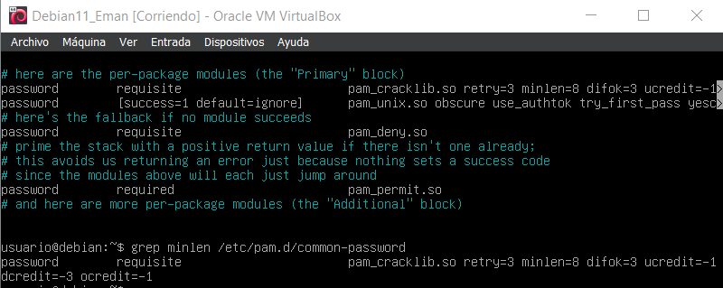

## Actividad 3- Ataques contra contraseñas en Sistemas Windows – FICHERO SAM -

El objetivo de la práctica es obtener las contraseñas de los usuarios del siguiente fichero hash y que puedes descargar dentro de los recursos de la unidad. 
(Utiliza rainbowcrack1.2-win)

## Actividad 4- Ataques contra contraseñas en Sistemas Windows

### Caso 1

Utilizar alguna de las herramientas indicadas en el tema para obtener las claves del fichero SAM de los usuarios de un S.O. Windows.

### Caso 2

Utilizar Kali (Exploits Herramienta MetaSploit en línea de comandos y Armitage GUI) para acceder al fichero SAM de un Windows. A continuación utilizando alguna de las aplicaciones que proporciona esta distribución para craquearlas.

### Caso 3

Resetea la clave de administración utilizando alguna de las distribuciones LIVE indicadas en el tema.

## Actividad 5.- Ataques contra contraseñas en Sistemas Linux

Utiliza BackTrack y John The Ripper para descubrir las contraseñas encriptadas de un equipo Ubuntu.

Para atacar contraseñas en Linux hemos de combinar la información de los archivos “/etc/passwd” y “/etc/shadow” y lo añadimos al fichero “contra.out” luego atacamos ese fichero de contraseñas cifradas utilizando el formato “crypt” con el comando 

    john --format-crypt

Y finalmente mostramos las contraseñas descifradas con el comando

    john –show

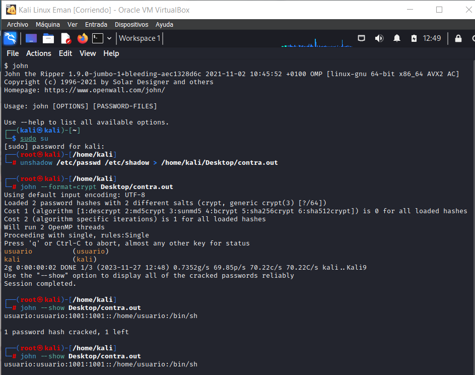

## Actividad 6.- Realiza un listado de este tipo de herramientas y analiza la instalación y configuración de 2 congeladores

El congelador que voy a usar es DeepFreeze en Windows, en la primera ventana le damos a siguiente aceptando la instalación

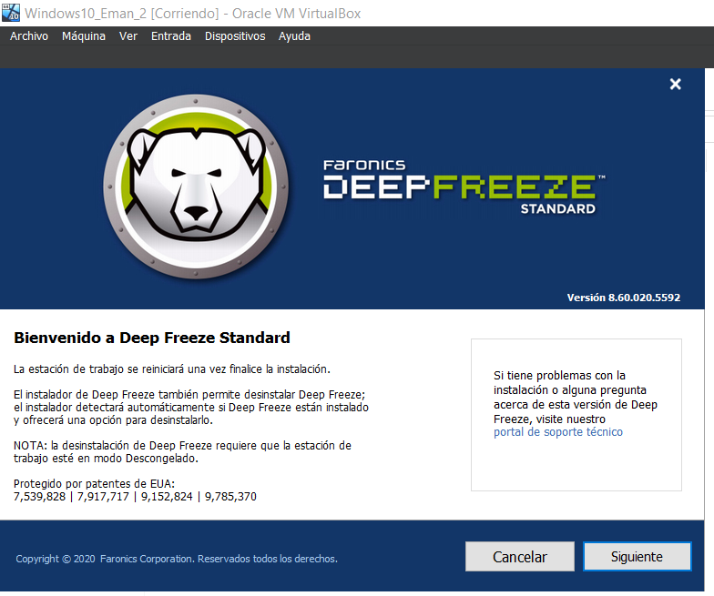

En la siguiente ventana aceptamos las condiciones del contrato de licencia, y le damos a siguiente

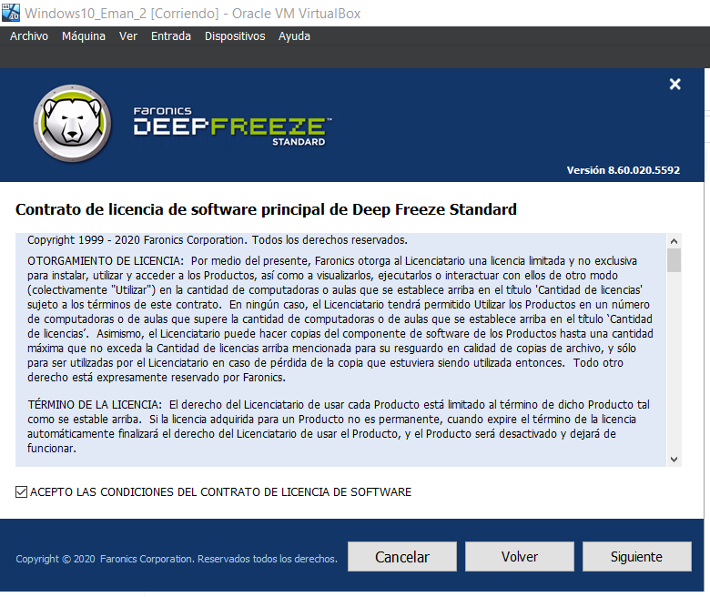

Como solo vamos a hacer una prueba gratuita le damos al check de “Evaluación de uso” y siguiente

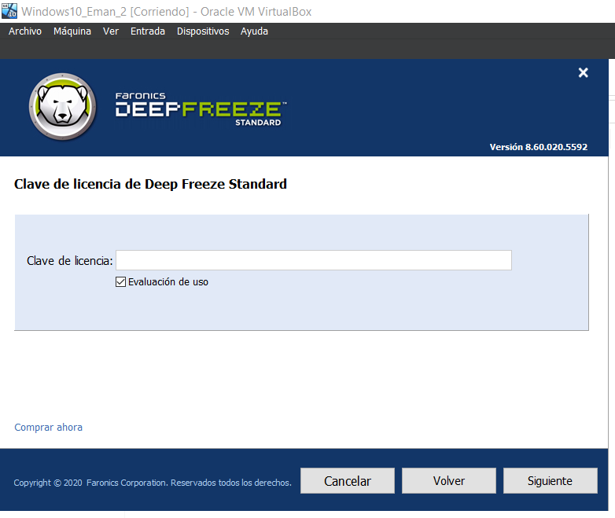

Aquí seleccionaremos que unidades queremos congelar para que se guarde el estado actual de esa unidad y aunque hagamos cambios en el una vez reiniciemos el sistema volvera a su estado normal

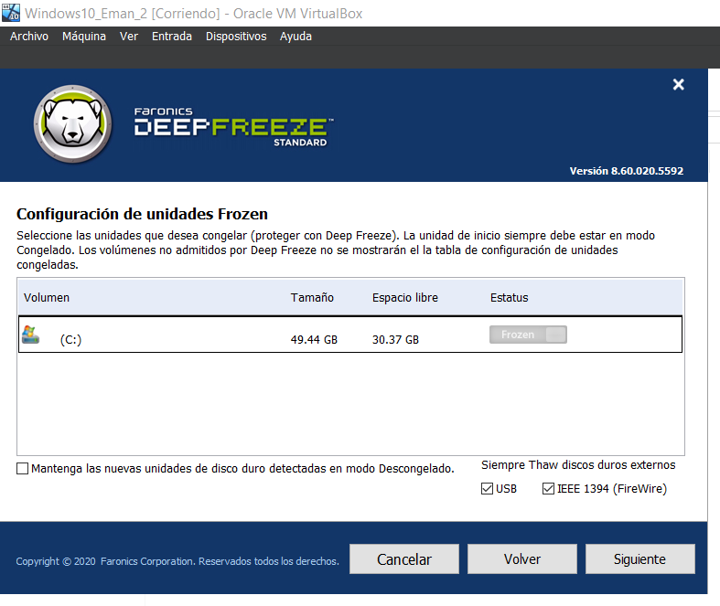

Aquí lo dejaremos por defecto y le damos a “Instalar”

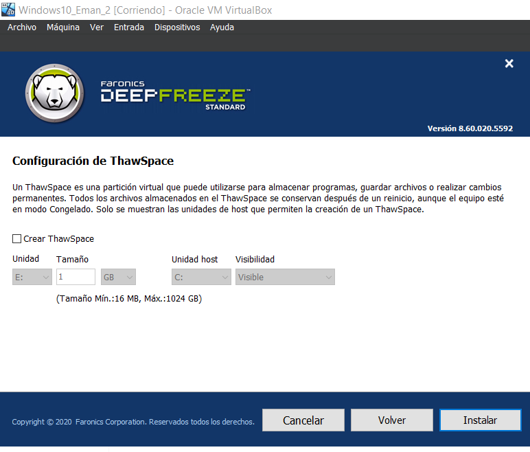

Esperamos a que se prepare la instalación

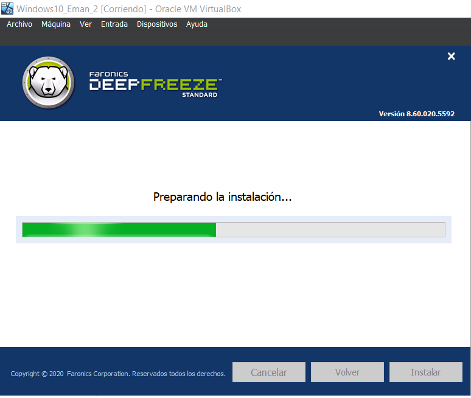

Una vez que se haya instalado abrimos el programa y habrán 3 opciones en el menú superior lo primero será ir a “Contraseña” y cambiar la contraseña para que la próxima vez al abrir el programa te pida una contraseña

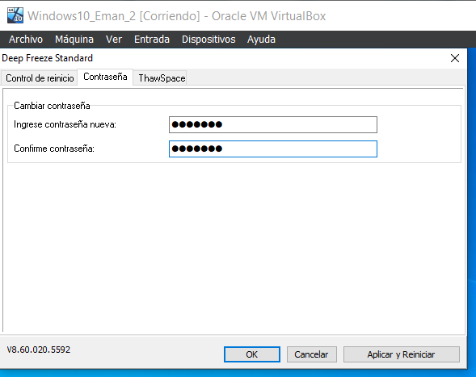

Después en la opción “ThawSpace” se puede hacer que en una partición gurades ficheros que aunque reincies no se vean sujetos al congeador ni que se eliminen

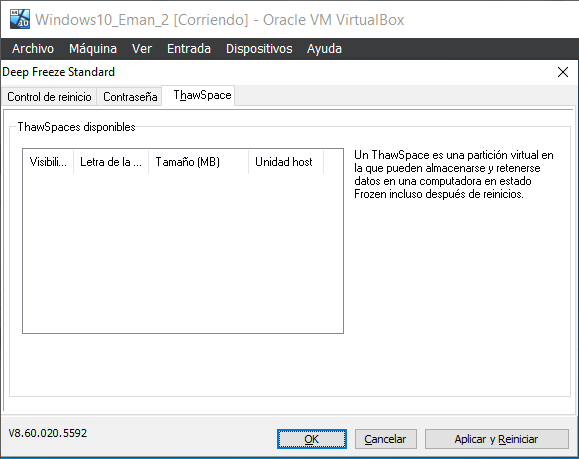

Ahora sería la creación de un monton de fichero para dar ejemplo del programa

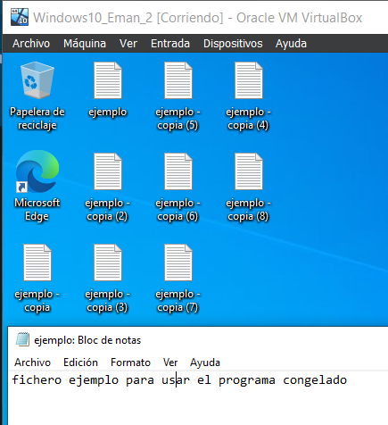

Luego nos vamos a la opción de “Control de acceso” dejamos la primera opción y le damos a “Aplicar y Reiniciar” una vez reiniciado el equipo no deberíamos ver ninguno de estos ficheros

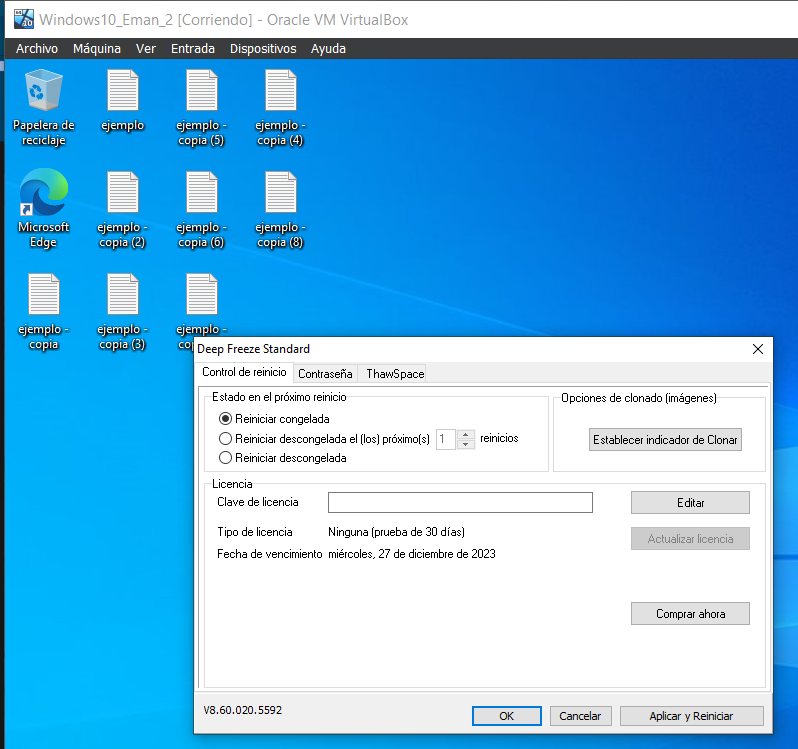

## Actividad 7: GRUB.

a) Protege con contraseña el GRUB, para que no se pueda ejecutar secuencia de comandos, como root, en el arranque.

b) Protege contraseña el arranque de los sistemas operativos.

Para proteger el inicio de los programas y no puedan ejecutar comandos usaremos grub2 para ello tendremos que instalarlo con el comando:

    sudo apt install grub2

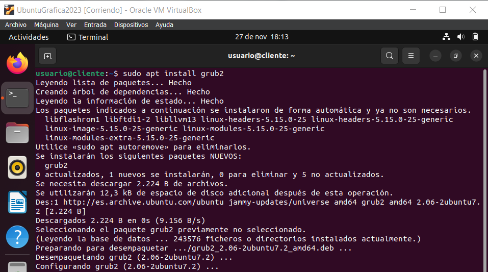

Ahora lo que haremos sera crear una contraseña grub con el comando:

    grub-mkpasswd-pkdf2
    
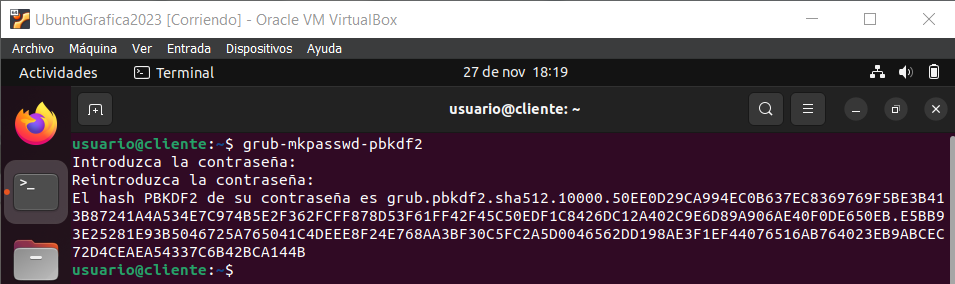

Luego modificamos el fichero “/etc/grub.d/00_header” y copiamos y pegamos la contraseña que antes nos han dado en la última linea del fichero  con el siguiente formato

cat <<EOF

set superuser=”root”

password_pbkdf2 root *contraseña*

EOF

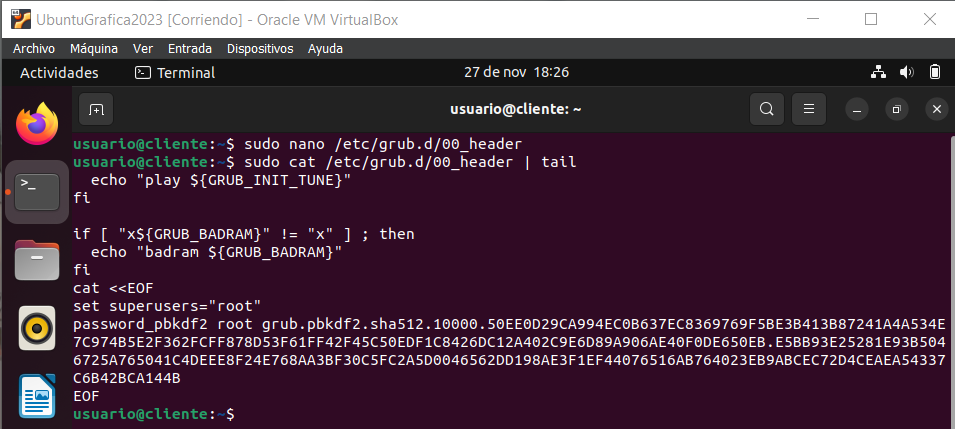

Finalmente restarteamos el paquete con:

    sudo update-grub2
    
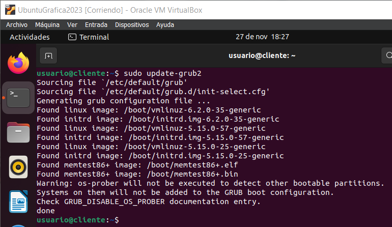

Ya finalmente si probamos a reiniciar la máquina vemos como para editar en el menú de grub nos pedira un nombre de usuario y contraseña

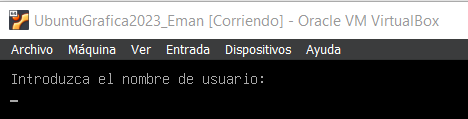

## Actividad 8: Servidor Radius. Autenticación en redes inalámbricas.

a) Instala y configura un servidor freeradius con soporte LDAP.

b) Protege con credenciales de usuario una red inalámbrica, creada con un router Mikrotik.
